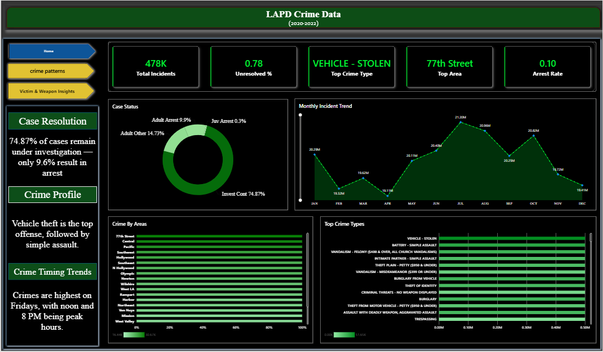
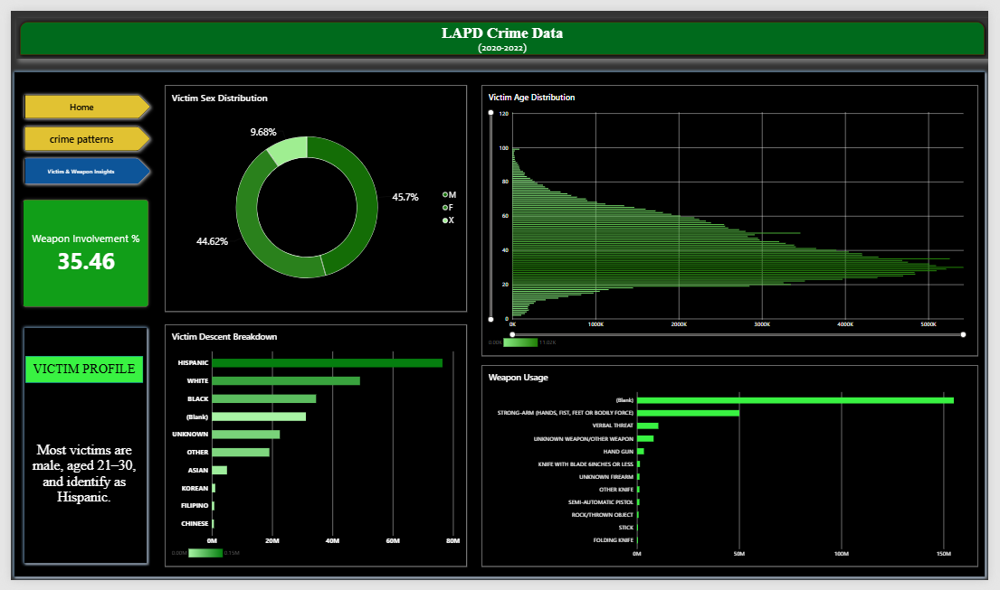

[Readme 2.md](https://github.com/user-attachments/files/31027999/Readme.2.md)
# LAPD-Crime-Analysis-Dashboard# LAPD Crime Analysis Dashboard

**Analyzing 3 years of LAPD crime data (2020–2022) to uncover crime patterns, hotspots, and victim insights across Los Angeles**

**You can view the demo video here:** [Watch the walkthrough](https://github.com/user-attachments/assets/931684c2-aad8-4e9a-ad82-4dceb69a534f)

---

## About the Project

This project analyzes raw LAPD crime incident data sourced from [data.gov](https://catalog.data.gov/), covering reported crimes across Los Angeles from 2020 to 2022. The raw dataset was messy — inconsistent formatting, blank fields, mixed date formats, and redundant columns — so a large part of this project focused on cleaning and structuring the data before building the dashboard.

The final Power BI dashboard turns 478,080 raw crime records into a clear, explorable report covering crime trends, hotspot areas, weapon involvement, and victim demographics.

- **Data Cleaning** — Excel & SQL
  - Removed duplicate and null records
  - Standardized date/time fields
  - Fixed inconsistent area, premise, and weapon category labels
  - Structured the dataset for reliable aggregation in Power BI
- **Dashboard Development** — Power BI
  - Built a 3-page interactive report: Home, Crime Patterns, and Victim & Weapon Insights
  - Added slicers for area and date range for interactive filtering

*Review the raw dataset:* **[Download here](https://1drv.ms/x/c/c4c49dbc75eb348c/IQAOCtK08dvkRrVMsyhUf_JhATJVenhp0T6HnCTrQ3i0HMk?e=hIbRYd)**

---

## Dashboard Preview

### Page 1 — Home
KPI overview: total incidents, unresolved rate, top crime type, top area, and arrest rate, alongside case status breakdown and monthly incident trends.



### Page 2 — Crime Patterns
Breakdown by premise type, citywide crime distribution on a map, crime by area, and peak crime hours/days.


### Page 3 — Victim & Weapon Insights
Victim sex, age, and descent distribution, along with weapon involvement and usage breakdown.



---

## Key Insights

- **9.6% arrest rate, 74.87% still under investigation** — Case backlog likely outpacing investigator capacity. Police should prioritize cases by solvability instead of treating all equally.
- **Vehicle theft is the #1 crime, above violent crime** — Easy opportunity, low risk. Police should increase surveillance in high-theft zones rather than general patrols.
- **77th Street & Central lead in crime volume** — Crime clusters, it doesn't spread evenly. Police should shift to hot-spot policing and concentrate resources on these specific areas.
- **Peaks on Fridays, noon & 8 PM** — Matches lunch-hour and evening/nightlife activity. Police should align patrol shifts with these peak windows, not spread evenly across the week.
- **35.46% involve weapons, mostly physical force, not firearms** — Suggests impulsive conflict, not premeditated armed crime. Police should invest in de-escalation training and faster response to disturbance calls.
- **Victims mostly male, 21–30, Hispanic** — Reflects demographics of high-crime areas and exposure during peak-risk hours. Police should target safety programs at this group in these areas.

---

## Tools Used

| Tool | Purpose |
|------|---------|
| **Excel** | Initial data inspection and cleanup |
| **SQL** | Data cleaning, deduplication, and transformation |
| **Power BI** | Dashboard design and interactive visualization |

---

## Repository Structure

```
├── new_report_1.csv          # Raw LAPD crime dataset
├── LAPD_crime_data.pbix      # Power BI dashboard file
├── visuals/                  # Dashboard screenshots
│   ├── dashboard-home.png
│   ├── dashboard-crime-patterns.png
│   └── dashboard-victim-weapon.png
└── README.md
```

---

## Data Source

Dataset sourced from [data.gov](https://catalog.data.gov/) — LAPD Crime Data (2020–2022).

---

## Contact

Feel free to connect or reach out if you have questions about this project!

- **LinkedIn:** [Deeksha Sharma](https://www.linkedin.com/in/deeksha-sharma-09639028a)
- **Email:** dishasha2004@gmail.com
